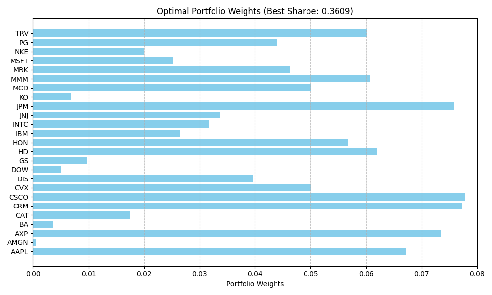

# Sharpe Optimization Project (Pedro Paulo Moreno Camargo)

---

## 1. Assignment

| Requirements                                   | Fulfilment in this repo                                 |
| ---------------------------------------------- | ------------------------------------------------------- |
| Use **30 Dow Jones** stocks                    | `data/download_data.py` pulls the full DJIA stocks‑set  |
| Training period: **01 Aug 2024 → 31 Dec 2024** | Default in `Makefile` (`TRAIN_*`)                       |
| Test period: **01 Jan 2025 → 31 Mar 2025**     | Default in `Makefile` (`TEST_*`)                        |
| Choose **k = 25** of 30 ($~142 k$ combos)      | `Simulate.combinations` enumerates all $\binom{30}{25}$ |
| **n = 1000** weight vectors per combo          | `randomWeights`  1000 weight vectors          |
| Long‑only, cap ≤ 20 % per asset                | Enforced in `Weights.validWeights`                      |
| Parallelised *and* pure                        | `parListChunk` + pure math, no mutable state inside parallel function            |

**Extras**  ⬇️ on‑demand data · 🔁 out‑of‑sample Sharpe · ⚡ serial vs parallel benchmarks.

---

## 1. Objective

Find the portfolio **weight vector** $w$ that maximises the **Sharpe Ratio**

$$
  SR = \frac{\mu^{\mathsf T} w}{\sqrt{w^{\mathsf T}\Sigma w}}
$$

subject to

$$
  \sum w_i = 1,\qquad 0 ≤ w_i ≤ 0.20
$$

Because the optimisation is non‑convex we perform an **exhaustive simulation**:

1. Enumerate every 25‑stock subset of the DJIA ($~142 060$).
2. For each subset, simulate 1000 random weights that satisfy the constraints (pre-generated and reused across subsets).
3. Compute Sharpe(μ, Σ, w) and keep the global maximum.

Total evaluations ≈ **142 million**.

## 2. Why functional? Why parallel?

* **Purity** — deterministic functions allow local reasoning and automatic memoisation.
* **Parallel safety** — no locks, no races.

Parallelism strategy:

* Split the combination list into `numCapabilities × 4` chunks.
* Evaluate each chunk with `rdeepseq` so every Sharpe value is fully reduced on its worker.
* Results are folded to a single `(Sharpe, names, weights)` triple.

---

## 3. Project Layout

### Architecture
```text
app/Main.hs 

src/SharpeOptimization/
├── **DataLoader.hs** 
├── **Statistics.hs** 
├── **Weights.hs** 
├── **SimulateSequential.hs** 
├── **SimulateParallel.hs**
└── **Types.hs** 

data/download\_data.py 

Makefile 
```
---

**Main.hs**
Handles all user interaction, input/output, and simulation coordination. It prompts for parameters like CSV paths, number of assets (k), and trials (n). It delegates data loading to `DataLoader`, calculates statistics via `Statistics`, and dispatches the simulation to either the sequential or parallel module depending on the user's choice. It also measures execution time and performs out-of-sample evaluation using the result CSV.

**DataLoader.hs**
Responsible for reading and validating input CSV files containing price data. It uses `ExceptT IO` to catch and propagate I/O and parsing errors cleanly. It trims the date column, checks column consistency across rows, and ensures all values are numeric. This module cleanly separates file I/O from the pure computation pipeline.

**Statistics.hs**
Implements all core mathematical functions required by the simulation. This includes transforming prices to daily returns, computing the mean return vector (μ), building the sample covariance matrix (Σ), and computing the Sharpe ratio efficiently. Also includes matrix-vector operations like dot product and matrix multiplication, designed to work with unboxed vectors for performance.

**Weights.hs**
Generates constrained random portfolios using rejection sampling. It ensures all weights are non-zero, normalized to sum to 1, and capped at a maximum of 20% per asset. This module is purely functional and deterministic given a random seed, and it returns batches of valid weight vectors alongside the updated random generator.

**SimulateSequential.hs**
Performs the exhaustive search over all combinations of k assets and their associated weight vectors using a single thread. It uses the μ and Σ from `Statistics` and weights from `Weights` to evaluate the Sharpe ratio of each portfolio and tracks the best result found. All logic is pure and designed to be thread-safe via explicit random state threading.

**SimulateParallel.hs**
Wraps the sequential simulation logic in parallel execution. It splits the list of combinations and the RNG state into disjoint chunks, maps each chunk in parallel using `parListChunk`, and folds the results into a single best portfolio using a custom `better` function. This module preserves determinism while improving performance on multi-core systems.

**Types.hs**
Centralizes all shared type definitions used across modules. It defines convenient aliases for prices, returns, weight vectors, and matrices using boxed and unboxed vectors. It also defines the `Best` result type, which encapsulates the Sharpe ratio, selected asset names, and weight vector.

**download\_data.py**
Python script that automates downloading historical stock prices from Yahoo Finance using the `yfinance` library. It outputs two CSV files: one for training and one for testing, each covering configurable date ranges. Used to populate `data/training.csv` and `data/result.csv`.

**Makefile**
Automates environment setup and data preparation. It defines targets for setting up a virtual environment, installing Python dependencies, downloading stock data, and cleaning up generated files. Supports environment customization through `TRAIN_*` and `TEST_*` variables.

---

### Simulation Flow

CSV → prices → returns → μ, Σ
  │
  ├─ combinations(k, 30)
  │  │
  │  ├─ generate n weight vectors (Weights.hs)
  │  ├─ sharpeRatioFast μ\[subset], Σ\[subset], w
  │  └─ keep best (Sharpe, names, w)
  ↓
best portfolio → re‑evaluated on test CSV

**Step-by-step explanation:**

1. **CSV Load (DataLoader.hs)**: The program reads a CSV file of stock closing prices, validates the data, and returns a matrix of prices for each stock.
2. **Transform to Returns (Statistics.hs)**: Converts the price matrix to a return matrix by calculating daily percentage changes.
3. **Compute μ and Σ (Statistics.hs)**: Computes the mean returns vector μ and the sample covariance matrix Σ from the return matrix.
4. **Generate Combinations (Statistics.hs)**: All 25-stock subsets (out of 30) are enumerated using combinatorics.
5. **Generate Weights (Weights.hs)**: For each combination, 1000 weight vectors are generated that respect the constraints.
6. **Evaluate Portfolios (Simulate\[Sequential|Parallel].hs)**: Each weight vector is evaluated via the Sharpe formula. The best-performing one (highest Sharpe ratio) is tracked.
7. **Out-of-sample Evaluation**: The best in-sample portfolio is evaluated again on a separate test dataset to check generalization.

> *Parallel execution* distributes step 6 across CPU cores while preserving pure and reproducible logic.

> *Parallel path* simply distributes the “combo loop”; math remains pure and deterministic.

## 4. Installation

### 4.1  Quick start

```bash
# clone
$ git clone https://github.com/<you>/sharpe-optimization.git && cd sharpe-optimization

# (optional) fetch market data
$ make python-setup        # .venv + yfinance, pandas
$ source .venv/bin/activate
$ make download-data       # if you want to get another period change variable in Makefile

# build Haskell executable
$ cabal build              # or: stack build
```

## 5. Running the Simulation

How to run:

```bash
$ cabal run sharpe-optimization-exe -- +RTS -N4
```

When running answer the questions:

Interactive run (defaults shown in `[]`):

```bash
Training CSV file path [default: data/training.csv]:
Result   CSV file path [default: data/result.csv]:
Number of assets to choose (k) [default: 25]:
Number of trials per combination (n) [default: 1000]:
Parallel? (1 = yes, 0 = no) [default: 1]:
```
## 6. Expected Output & Benchmarks
```
⏳ Running simulation over 25-asset portfolios (50 trials each)...

✔️  Best Sharpe portfolio found:
    Sharpe Ratio : 0.19133890490130517
    Assets / Weights:
      AAPL  ->  6.61426573572841e-2
      AMGN  ->  5.7662123184381936e-2
      AXP  ->  6.049365088186588e-2
      BA  ->  2.9881444099959686e-2
      CAT  ->  1.6502922939016243e-2
      CRM  ->  4.377581824715346e-2
      CSCO  ->  6.636225408207679e-2
      CVX  ->  1.4271888618188582e-2
      DIS  ->  5.4044253860645264e-2
      DOW  ->  6.60192530454152e-2
      GS  ->  6.763640964414544e-2
      HD  ->  4.833322115709522e-2
      HON  ->  2.7758743908091885e-2
      IBM  ->  5.345353976300215e-2
      INTC  ->  1.387311090131029e-2
      JNJ  ->  2.5924101900068552e-2
      JPM  ->  5.576292711529842e-2
      KO  ->  4.686583069822723e-2
      MCD  ->  3.1999587813132256e-3
      MMM  ->  2.117927048681058e-2
      MRK  ->  1.36148190273245e-3
      MSFT  ->  4.391043299696419e-3
      NKE  ->  4.485089765131787e-2
      PG  ->  5.0749493832663126e-2
      TRV  ->  5.95037026422398e-2

⏱️  Optimization Elapsed time: 22.77 seconds

🔁 Evaluating same portfolio on result dataset...
✅ New Sharpe Ratio on result dataset: -2.3305575327931777e-2
😕 Worse or equal Sharpe in result dataset.
```
## 7. Results

| Cores  | **Best Sharpe Ratio (2024_2nd_Semester)** | **Optimization Time (s)** | **Best Sharpe Ratio (2025_1st_Trimester)** | **Comparison**                          |
| -------------- | ----------------------- | ------------------------- | --------------------------------- | --------------------------------------- |
| 4  | 0.31707951483423114     | 162.4                     | 4.324464935386083e-3              | Worse Sharpe in Trimester |
|  4  | 0.33898489256815745     | 170.43                    | -1.7167632267105295e-2            | Worse Sharpe in Trimester|
|  8  | 0.29796031386257094     | 112.63                    | -1.7389490189320743e-4            | Worse Sharpe in Trimester|
| 8 | 0.36091653571516474     | 113.99                    | -3.790277278120213e-2            | Worse Sharpe in Trimester|

### Key Observations:
- **Best Sharpe Ratio (2024)**: Sharpe ratios range between **0.2979** and **0.3609**, indicating strong portfolio selection during training.
- **Sharpe Ratio (2025)**: Significant drop in Sharpe ratios for the test period (from **4.32e-3** to **-3.79e-2**), indicating poor generalization.
- **Optimization Time**: Optimization time improves with 8 cores (**113 seconds**) vs. 4 cores (**162-170 seconds**), showing efficient parallel scaling.

### Optimal Portfolio Visualization:
The chart below shows the **optimal portfolio weights** based on the highest Sharpe ratio of **0.3609** found during the simulation:



## 8. AI Usage Disclosure

* Creating and Optimizing Functions;
* Writing Readme
* Cabal Structure

