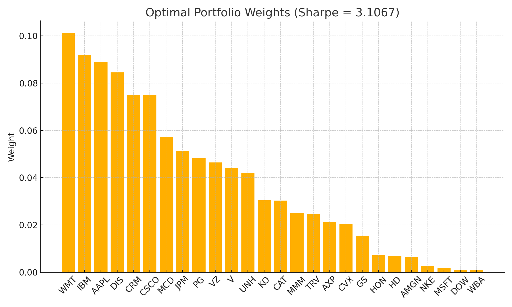

# Sharpe Optimization Project (Pedro Paulo Moreno Camargo)

---

## 1. Assignment

| Requirements                                   | Fulfilment in this repo                                 |
| ---------------------------------------------- | ------------------------------------------------------- |
| Project implements a functional programming language | The executable is written in `Haskell` |
| Use **30 Dow Jones** stocks                    | `data/download_data.py` pulls the full DJIA stocks‑set  |
| Training period: **01 Aug 2024 → 31 Dec 2024** | Default in `Makefile` (`TRAIN_*`)                       |
| Test period: **01 Jan 2025 → 31 Mar 2025**     | Default in `Makefile` (`TEST_*`)                        |
| Choose **k = 25** of 30 ($~142 k$ combos)      | `Simulate.combinations` enumerates all $\binom{30}{25}$ |
| **n = 1000** weight vectors per combo          | `randomWeights`  1000 weight vectors          |
| Long‑only, cap ≤ 20 % per asset                | Enforced in `Weights.validWeights`                      |
| Parallelised *and* pure                        | `parListChunk` + pure math, no mutable state inside parallel function            |

**Extras**   ✅ Test portfolio for First Trimester of 2025 · ⚡ serial vs parallel benchmarks.

---

## 1. Objective

Find the portfolio **weight vector** $w$ that maximises the **Sharpe Ratio**

$$
  SR = \frac{\mu^{\mathsf T} w}{\sqrt{w^{\mathsf T}\Sigma w}}
$$

subject to

$$
  \sum w_i = 1,\qquad 0 ≤ w_i ≤ 0.20
$$

Because the optimisation is non‑convex we perform an **exhaustive simulation**:

1. Enumerate every 25‑stock subset of the DJIA ($~142 060$).
2. For each subset, simulate 1000 random weights that satisfy the constraints (pre-generated and reused across subsets).
3. Compute Sharpe(μ, Σ, w) and keep the global maximum.

Total evaluations ≈ **142 million**.

## 2. Why functional? Why parallel?

* **Purity** — deterministic functions allow local reasoning and automatic memoisation.
* **Parallel safety** — no locks, no races.

Parallelism strategy:

* Split the combination list into `numCapabilities × 4` chunks.
* Evaluate each chunk with `rdeepseq` so every Sharpe value is fully reduced on its worker.
* Results are folded to a single `(Sharpe, names, weights)` triple.

---

## 3. Project Layout

### Architecture Overview

**Directory Structure:**
```text
app/Main.hs  – 📋 CLI orchestration, IO, and coordination

src/SharpeOptimization/
├── 📄 **DataLoader.hs**        – CSV ingestion and validation
├── 📊 **Statistics.hs**        – Mathematical operations: μ, Σ, Sharpe
├── 🎲 **Weights.hs**           – Random constrained portfolio generation
├── 🧮 **SimulateSequential.hs** – Exhaustive pure single-threaded simulation
├── ⚙️  **SimulateParallel.hs**   – Parallelized search wrapper
└── 🧾 **Types.hs**             – Type aliases and core data definitions

data/download\_data.py – 🗃 Fetches DJIA prices from Yahoo Finance
Makefile              – 🛠 Setup, fetch, and cleanup automation
```
---

### Module Descriptions

#### 📄 DataLoader.hs

Handles all CSV processing and encapsulates I/O safely:

* Reads training (2nd-Semester-2024) and test (1st-Trimester-2025) datasets from CSV files.
* Drops the first column (typically a "Date" field) to isolate numeric stock prices.
* Validates each line to ensure column consistency and that all values are numeric.
* Wraps all I/O, parsing, and validation using `ExceptT IO`.
* Returns stock names and a matrix of price data as a tuple: `(StockNames, [[Double]])`.

#### 📊 Statistics.hs

Implements all core numerical computations in pure form:

- **`toPriceMatrix :: [[Double]] -> PriceMatrix`**  
  Converts a list of lists from CSV parsing into a boxed matrix of unboxed price vectors.

- **`priceMatrixToReturns :: PriceMatrix -> ReturnMatrix`**  
  Converts price matrix into a matrix of daily returns:  
  each return is calculated as `(pₜ₊₁ / pₜ) - 1` for each asset.

- **`mean :: (G.Vector v Double) => v Double -> Double`**  
  Computes the arithmetic mean of a generic vector.  
  Used in μ and Σ calculations.

- **`muVector :: ReturnMatrix -> U.Vector Double`**  
  Computes the mean return (μ) for each asset (column-wise).

- **`covarianceMatrix :: ReturnMatrix -> CovarianceMatrix`**  
  Computes the sample covariance matrix (Σ) by:
  - centralizing each column (subtracting its mean),
  - computing pairwise dot products,
  - dividing by `n - 1`.

- **`dotProductU :: U.Vector Double -> U.Vector Double -> Double`**  
  Computes the dot product between two unboxed vectors.  
  Used heavily in Sharpe ratio and matrix algebra.

- **`matVecU :: V.Vector (U.Vector Double) -> U.Vector Double -> U.Vector Double`**  
  Multiplies a boxed matrix of unboxed vectors by a column vector.  
  Used in variance computation for the Sharpe ratio.

- **`sharpeRatioFast :: U.Vector Double -> CovarianceMatrix -> Weights -> Maybe Sharpe`**  
  Computes the **annualized Sharpe ratio**:
  Returns `Nothing` if variance is near-zero (numerical stability safeguard).

- **`selectByIndexesU :: [Int] -> U.Vector a -> U.Vector a`**  
  Utility to extract a subvector by index list.  
  Used to reduce μ and Σ to k-dimensional subspaces.

- **`transpose :: V.Vector (U.Vector a) -> V.Vector (U.Vector a)`**  
  Transposes a matrix of unboxed vectors (rows ↔ columns).  
  Used for column-wise statistics like μ and Σ.

- **`centralizeMatrix :: ReturnMatrix -> ReturnMatrix`**  
  Centralizes each column of the return matrix (mean = 0).  
  Required before computing Σ.
  
#### 🎲 Weights.hs

Generates random portfolio weights subject to constraints:

* Uses rejection sampling to enforce valid portfolios:

  * All weights ≥ 0, ∑wᵢ ≈ 1, and no weight > 20%.
* All logic is purely functional and deterministic when given a `StdGen`.
* Returns a list of weight vectors along with the updated random generator.
* Ensures compliance with problem constraints for every trial portfolio.

#### ➡️ SimulateSequential.hs

Implements the exhaustive search engine for simulation in a single thread:

* Enumerates all combinations of `k` out of 30 DJIA stocks (≈ 142k portfolios).
* For each combination, generates `n` valid random weights.
* Computes the Sharpe ratio using the subsets of μ and Σ from `Statistics`.
* Tracks the highest-performing portfolio across all evaluated combinations.
* Threads random generator state manually to ensure reproducibility.
* Entirely pure and referentially transparent.

#### 🔄 SimulateParallel.hs

Parallel backend for simulation with multi-core optimization:

* Splits all combinations into `numCapabilities × 4` chunks for load balancing.
* For each chunk:

  * Assigns an independent random generator (via `splitMany`).
  * Evaluates all weight trials in parallel with `parListChunk` and `rdeepseq`.
* Sharpe ratios are computed as in the sequential path.
* All intermediate results are reduced using a custom `better` comparator.
* Fully deterministic, while significantly improving performance on multi-core machines.

#### 🧾 Types.hs

Defines core type aliases to unify the project interface:

* `PriceMatrix`, `ReturnMatrix`, and `CovarianceMatrix` are declared for clarity.
* Uses `Vector` for outer structures and `U.Vector` for inner rows (performance).
* `Weights` is an unboxed vector of Doubles.
* `Best` encapsulates the best portfolio result: `(Sharpe, Stocks, Weights)`.
* Central to the consistency and readability of all math and logic.

#### 🗃 download\_data.py

Fetches historical stock price data using Python and `yfinance`:

* Downloads daily close prices for the 30 DJIA stocks.
* Saves training and testing datasets to `data/training.csv` and `data/result.csv`.
* Dates for training and testing periods are configurable via command-line args or Makefile variables.
* Used as the primary data source for the simulation pipeline.

#### 🛠 Makefile

Facilitates development, testing, and environment setup:

* Automates the creation of a Python virtual environment.
* Installs required Python dependencies: `yfinance`, `pandas`.
* Defines reusable commands for downloading data and cleaning up generated files.
* Includes targets:

  * `python-setup` — setup venv and install dependencies
  * `download-data` — run data downloader with configured dates
  * `clean-data`, `clean-env`, `clean-all` — housekeeping targets

---

### Simulation Flow
```text
CSV → prices → returns → μ, Σ
  │
  ├─ combinations(k, 30)
  │  │
  │  ├─ generate n weight vectors (Weights.hs)
  │  ├─ sharpeRatioFast μ\[subset], Σ\[subset], w
  │  └─ keep best (Sharpe, names, w)
  ↓
best portfolio → re‑evaluated on test CSV
```
**Step-by-step explanation:**

1. **CSV Load (DataLoader.hs)**: The program reads a CSV file of stock closing prices, validates the data, and returns a matrix of prices for each stock.
2. **Transform to Returns (Statistics.hs)**: Converts the price matrix to a return matrix by calculating daily percentage changes.
3. **Compute μ and Σ (Statistics.hs)**: Computes the Global mean returns vector μ and sample covariance matrix Σ from the return matrix.
4. **Generate Combinations (Statistics.hs)**: All 25-stock subsets (out of 30) are enumerated using combinatorics.
5. **Generate Weights (Weights.hs)**: For each combination, 1000 weight vectors are generated that respect the constraints.
6. **Evaluate Portfolios (Simulate\[Sequential|Parallel].hs)**: Each weight vector is evaluated via the Sharpe formula. The best-performing one (highest Sharpe ratio) is tracked.
7. **Out-of-sample Evaluation**: The best in-sample portfolio is evaluated again on a separate test dataset to check generalization.

> *Parallel execution* distributes step 6 across CPU cores while preserving pure and reproducible logic.

> *Parallel path* simply distributes the “combo loop”; math remains pure and deterministic.

## 4. Installation

### 4.1  Quick start

```bash
# clone
$ git clone https://github.com/<you>/sharpe-optimization.git && cd sharpe-optimization

# (optional) fetch market data
$ make python-setup        # .venv + yfinance, pandas
$ source .venv/bin/activate
$ make download-data       # if you want to get another period change variable in Makefile

# build Haskell executable
$ cabal build              # or: stack build
```

## 5. Running the Simulation

How to run:

```bash
$ cabal run sharpe-optimization-exe -- +RTS -N4
```

When running answer the questions:

Interactive run (defaults shown in `[]`):

```bash
Training CSV file path [default: data/training.csv]:
Result   CSV file path [default: data/result.csv]:
Number of assets to choose (k) [default: 25]:
Number of trials per combination (n) [default: 1000]:
Parallel? (1 = yes, 0 = no) [default: 1]:
```
## 6. Expected Output
```
=== Sharpe Optimization ===
Training CSV file path [default: data/training.csv]: 
Result CSV file path [default: data/result.csv]: 
Number of assets to choose (k) [default: 25]: 
Trials per combination (n) [default: 1000]: 
Parallel? (1 = yes, 0 = no) [default: 1]: 

🧠 Using 4 CPU core(s)
⏳ Running parallel simulation over 25-asset portfolios (1000 trials each)...

✔️  Best Anual Sharpe portfolio found:
    Sharpe Ratio : 3.090032468460209
    Assets / Weights:
      AAPL  ->  8.283037177942251e-2
      AMGN  ->  9.918595969828782e-4
      AXP  ->  8.137273897878745e-2
      CAT  ->  1.9774265692960574e-3
      CRM  ->  8.54589779240911e-2
      CSCO  ->  7.556553832670138e-2
      DIS  ->  5.9731012255817326e-2
      GS  ->  5.159661482929821e-4
      HD  ->  3.520916239734654e-2
      HON  ->  6.317045464461094e-3
      IBM  ->  7.55551150626902e-2
      JNJ  ->  1.4514462581214502e-2
      JPM  ->  8.053475635461343e-2
      KO  ->  1.0434415408393388e-2
      MMM  ->  1.800253592949377e-3
      MRK  ->  6.4707532831930386e-3
      MSFT  ->  1.0367397573676253e-2
      NKE  ->  3.3442086954724236e-3
      PG  ->  7.419093480133743e-2
      TRV  ->  6.782330360273364e-2
      UNH  ->  4.366927675591561e-2
      V  ->  7.476515711377717e-2
      VZ  ->  1.0882269331593359e-2
      WBA  ->  2.5151976386460465e-3
      WMT  ->  9.316239876259484e-2

⏱️  Elapsed time: 199.79 s

🔁 Evaluating same portfolio on result dataset...
✅ New Anual Sharpe Ratio: -0.36654063525308633
😕 Sharpe did not improve.

```
## 7. Updated Output & Benchmarks

### 🔁 Summary of Best Sharpe Ratios

| Mode        | k  | Trials (n) | Sharpe (Train) | Time (s) | Sharpe (Test) | Outcome                  |
|-------------|----|------------|----------------|----------|----------------|---------------------------|
| Parallel    | 28 | 1000       | 2.5608         | 7.97     | 0.4674         | Did not improve           |
| Sequential  | 28 | 1000       | 2.6235         | 16.41    | 0.1422         | Did not improve           |
| Parallel    | 27 | 1000       | 2.7364         | 13.12    | 0.1805         | Did not improve           |
| Sequential  | 27 | 1000       | 2.7542         | 46.17    | 0.2351         | Did not improve           |
| Parallel    | 26 | 1000       | 3.0344         | 46.12    | 0.0738         | Did not improve           |
| Sequential  | 26 | 1000       | 3.1067         | 236.93   | 0.0580         | Did not improve           |
| Parallel    | 25 | 1000       | 3.0900         | 199.79   | -0.3665        | Did not improve           |
| Sequential  | 25 | 1000       | 3.0819         | 1174.10  | 0.3213         | Did not improve           |

### Key Observations:
- **Best training Sharpe Ratio**: 3.1067 (Sequential, k=26)
- **Best test Sharpe Ratio**: 0.4674 (Parallel, k=28)
- **Overall**: All training-optimal portfolios showed **Sharpe deterioration** in the test dataset.
- **Performance**: Parallel execution consistently **outperformed sequential** in speed by a wide margin.

### 📊 Optimal Portfolio Visualization

The chart below shows the **portfolio weights** for the best Sharpe ratio (**3.1067**, Sequential, k=26):



## 8. AI Usage Disclosure

* Creating and Optimizing Functions
* Writing Readme
* Cabal Structure
* Commenting Code

